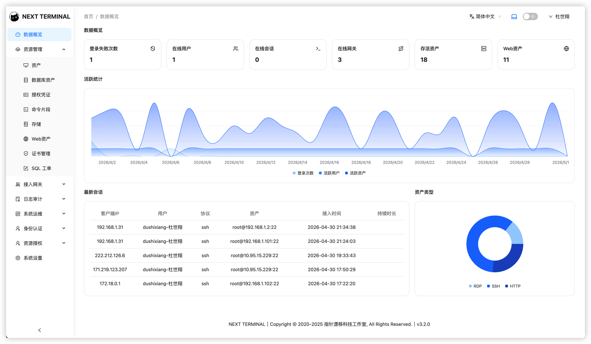
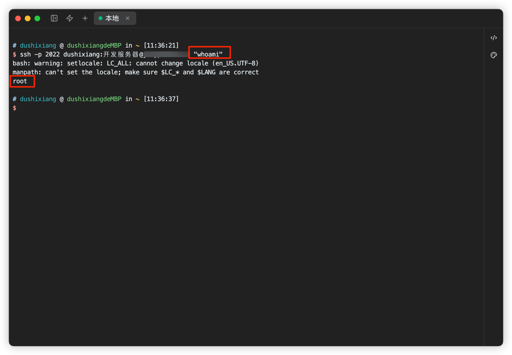
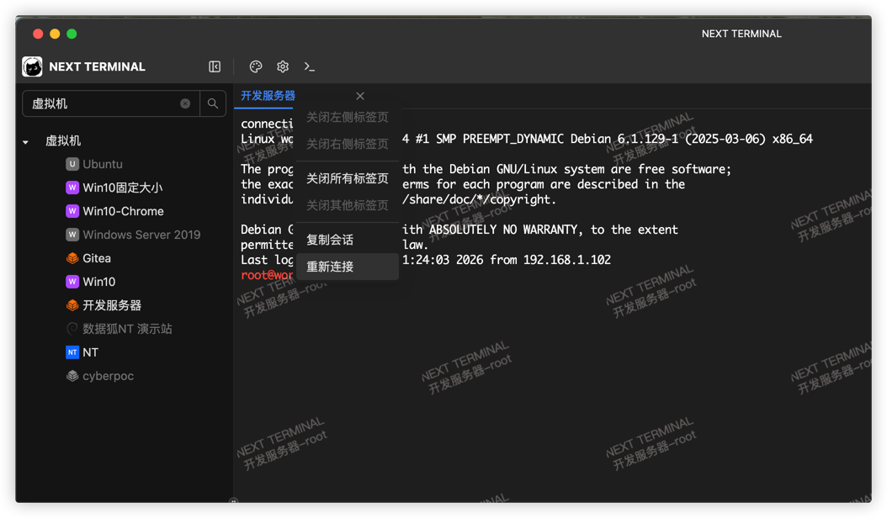
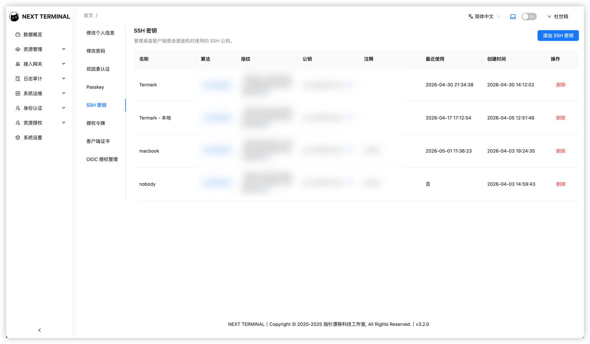
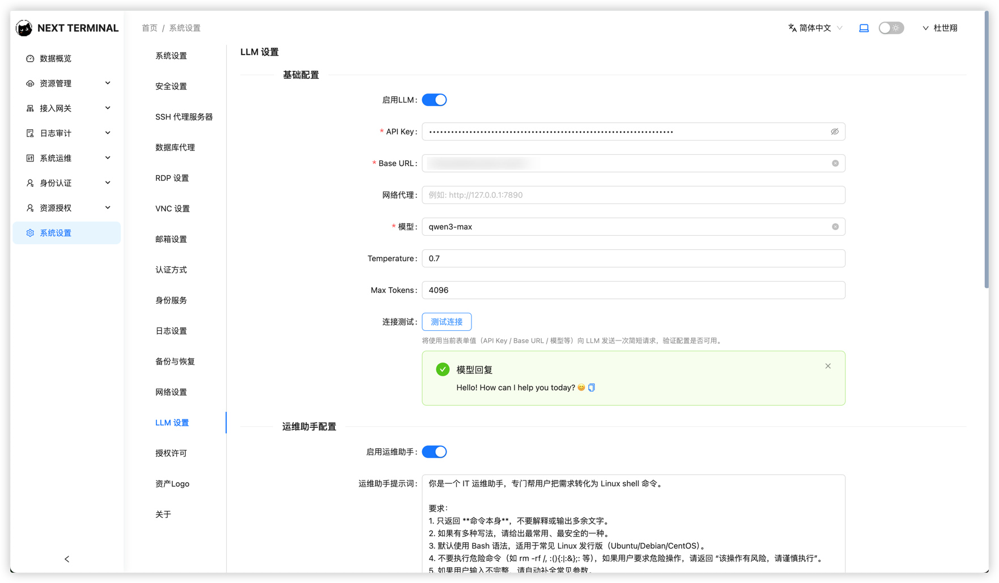
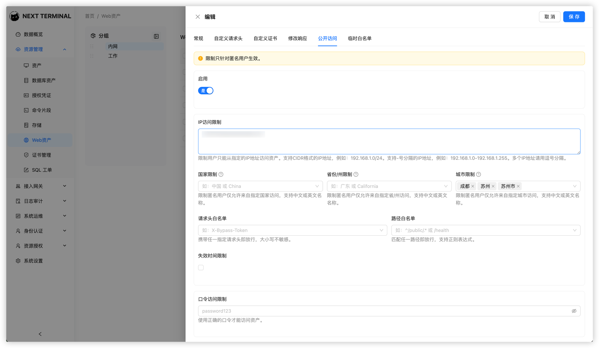
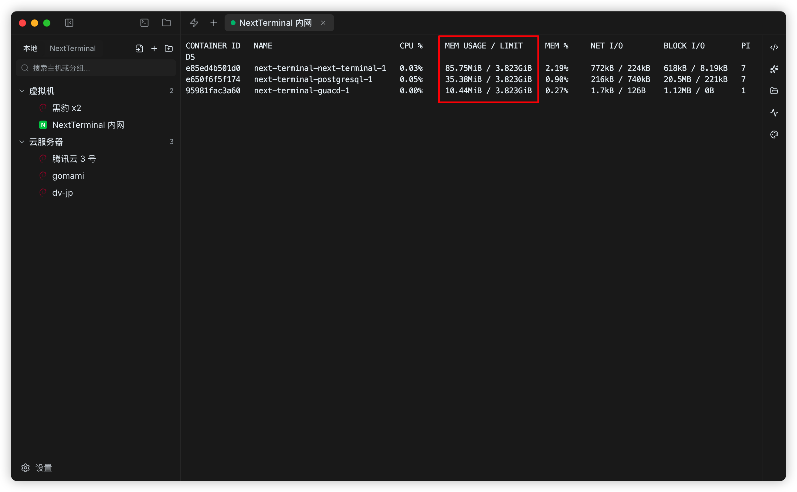
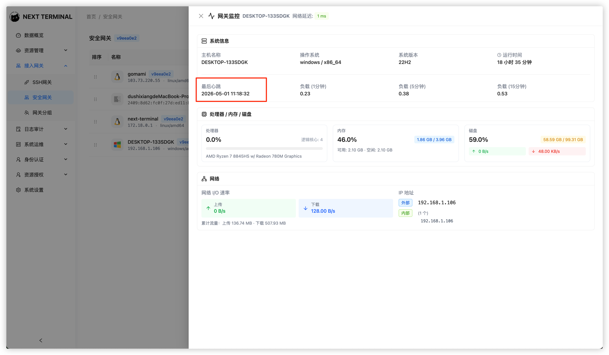
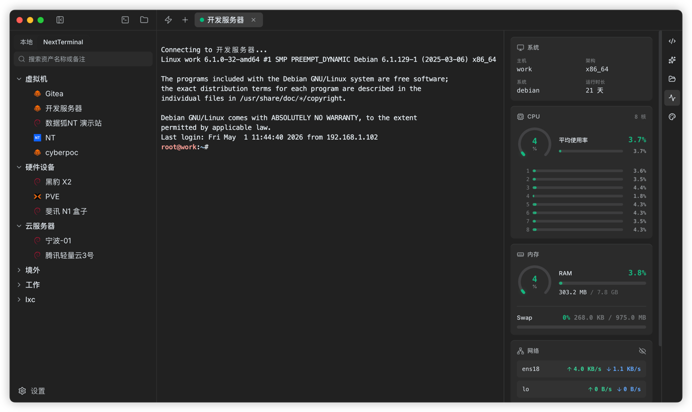

# Next Terminal v3.2.0: Stronger Auth, Smoother Terminal

Next Terminal v3.2.0 is live. Rather than just stacking features, this release continues along four long-running directions: **more secure connections, more complete proxy capabilities, smoother terminal operations, and finer-grained access control**.

If you manage SSH, Telnet, databases, Web assets, or secure gateways with Next Terminal, you will feel the changes directly in day-to-day use.



## 1. More Flexible mTLS: client certificate verification modes

Next Terminal already supports HTTPS mutual TLS (mTLS), generating per-user client certificates to harden Web asset reverse-proxy access.

v3.2.0 adds `MTLSClientCertAuthMode` with two modes:

- `strict`: verify client certificate fingerprint and expiry
- `ca_only`: verify that the certificate is issued by the same trusted CA

`strict` fits scenarios where identity is explicit and fingerprint-bound. `ca_only` fits teams with a unified CA issuance pipeline, where any certificate from the same CA should pass without per-certificate pinning.

```yaml
ReverseProxy:
  MTLSClientCertAuthMode: "strict"
```

> Docs: [mTLS](/usage/mtls)

## 2. More Complete: SSH proxy now supports remote command execution

Many SSH proxy users do not just need an interactive shell — they need to `ssh host "command"`, run batch checks, or drive automation via the bastion.

v3.2.0 adds **remote command execution** to the SSH proxy, plus a fix for **environment variable forwarding**, making scripting and tooling through the bastion behave like native SSH.



## 3. Smoother Terminal

- **macOS Option as Meta**: Option can now act as Meta for cursor movement and editing, closer to a native terminal.
- **Fixed-width tabs**: tab bar stays stable with many sessions.
- **Duplicate session** from the tab context menu.
- **Horizontal scroll** in the asset tree for long names and deep nesting.



## 4. Clearer: User Public Keys Get Their Own Page

User SSH public keys are now managed on a dedicated settings page — easier to find, explain, and maintain.



## 5. More Controllable: Group Search in Asset Tree

Besides asset name search, v3.2.0 adds **group search** — find a whole project, site, or business-unit folder without expanding the tree manually.

## 6. More Reliable: Connectivity Tests for LLM and Database

Save-time validation now includes **connectivity tests** for LLM and database connections: address reachability, credentials, network policy, and API keys are checked before you discover a failure at use time.



## 7. Finer Policy: Web Asset PublicAccess Rules

PublicAccess now evaluates four dimensions — **IP, GEO, headers, and path** — and the logic is explicit:

- No rules configured → allow
- Password configured → caller verifies
- Any rule hit → allow and skip password

This supports cases like fixed egress IPs, callback paths, or header-based trust without fully opening the asset.



## 8. Lighter: Server Memory ~200MB → ~80MB

Previously, multi-platform gateway binaries were embedded in the server binary. Simple to ship, but it pushed memory beyond **200 MB**.

v3.2.0 stops embedding gateway binaries in the server. Server footprint drops to about **80 MB**, better for small cloud instances, VMs, and NAS.



Gateway monitoring also adds **last heartbeat time** for quick health checks.



## 9. New SSH Client: Termark

We also ship a native SSH client — [Termark](https://mp.weixin.qq.com/s/mmPuyLIJ_ZAWjGlsDdNdAQ) — that connects directly to Next Terminal-authorized SSH assets. Manage assets and permissions in Next Terminal, connect from the local client without maintaining a duplicate inventory.



## 10. Other Polish and Fixes

- File editor shows full path
- Autofill disabled on Add Asset forms
- Long fields in access logs render more stably
- Web asset logo validation polished, Passkey copy unified, SSH/Telnet command parsing improved
- Fixes: admin password-change timestamp, SSH env forwarding, reverse-proxy HTTP leak, and module init no longer blocked by one failed module

> Quick start: [Container Install](/install/container-install) · [FAQ: PostgreSQL 16→18](/faq/postgresql-16-to-18) · Demo: [https://demo.next-terminal.com](https://demo.next-terminal.com) · Pricing: [https://www.next-terminal.com/pricing](https://www.next-terminal.com/pricing)
