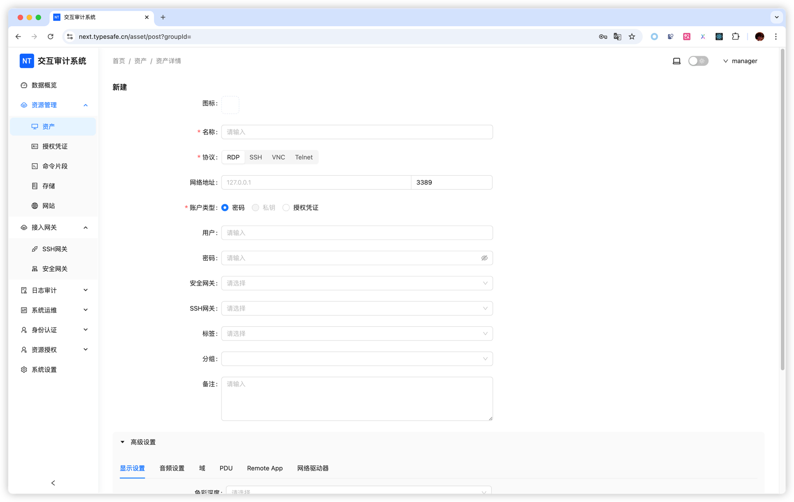

# Asset Management Overview

Next Terminal calls every managed remote resource an asset. Because configuration, access methods and available tools differ significantly by protocol, this page covers only shared concepts and directs you to protocol-specific guides.

## Choose a guide by asset type

| Resource | Guide | Main capabilities |
| --- | --- | --- |
| Linux, Unix and network devices | [SSH Assets](/docs/usage/ssh) | Web terminal, SFTP file management, snippets and SSH client access |
| Windows servers and desktops | [Windows / RDP Assets](/docs/usage/rdp) | Web desktop, clipboard, network drive, RemoteApp and native RDP clients |
| Graphical control and legacy terminals | [VNC and Telnet Assets](/docs/usage/vnc-telnet) | VNC graphical sessions and Telnet terminals |
| Internal websites | [Web Assets](/docs/usage/website) | Authentication, reverse proxy, authorization and private publishing |
| Databases | [Database Audit](/docs/usage/database) | Database proxy, SQL approval and audit |

## Common asset workflow

1. Confirm that Next Terminal or the selected gateway can reach the target address and port.
2. Prepare a target-system password or private key; create a reusable [Credential](/docs/usage/credential) when appropriate.
3. Open **Asset Management > Assets** and click **Create**.
4. Select a protocol and enter the name, address, port and account.
5. Complete the protocol-specific advanced settings.
6. Save the asset and test it as an administrator.
7. Use [Resource Authorization](/docs/usage/authorization) to assign it to users or departments.
8. Connect through the browser, a proxy server or Termark.

## Shared fields

| Field | Purpose |
| --- | --- |
| Name | Name shown in administration and user asset lists |
| Alias | Target name for SSH proxy direct mode; starts with a letter and uses letters, numbers, underscores or hyphens |
| Group | Hierarchy used in the asset tree and group authorization |
| Protocol | Determines the port, authentication, session type and advanced settings |
| Network address | Target IP/hostname and port reachable through the actual connection path |
| Account type | Direct password, SSH private key or saved credential |
| Gateway chain | Forwarding path used when the target cannot be reached directly |
| Tags | Cross-group properties such as environment, region and owner |
| Notes | Operational context; never store passwords or tokens here |

## Groups, tags and bulk operations

- Use **groups** for stable hierarchy, such as `Production / Shanghai / Windows`.
- Use **tags** for cross-cutting properties, such as `critical`, `finance` or `vendor`.
- For **bulk import**, download the current template, test a small batch, then verify protocol, port, credential, group and gateway values.
- Use **bulk edit** carefully to update shared properties such as gateways.

<!-- TODO(image): Add current screenshots for group editing, tag filters, bulk import and bulk edit. -->

## Choose a network path

- Directly reachable from the Next Terminal server: do not select a gateway.
- Located in a VPC, office network or remote site: use a [Security Gateway](/docs/usage/agent-gateway).
- Reachable through an existing SSH jump host: use an [SSH Gateway](/docs/usage/ssh-gateway).
- With a gateway chain, enter the address reachable from the final gateway, not the address visible only from the user's computer.

## Why a newly created asset may still be unavailable

Creating an asset stores connection information but does not grant every user access. Check that:

1. An administrator can connect successfully.
2. The user or department has resource authorization.
3. The authorization has not expired.
4. Its access strategy permits required actions such as upload, download and clipboard use.
5. The selected access method supports the protocol.

## Related functions

- [Credentials](/docs/usage/credential)
- [Resource Authorization and Access Strategies](/docs/usage/authorization)
- [File Management](/docs/usage/file-management)
- [Browser Access Workspace](/docs/usage/access)
- [Security Gateway](/docs/usage/agent-gateway)
- [SSH Gateway](/docs/usage/ssh-gateway)
