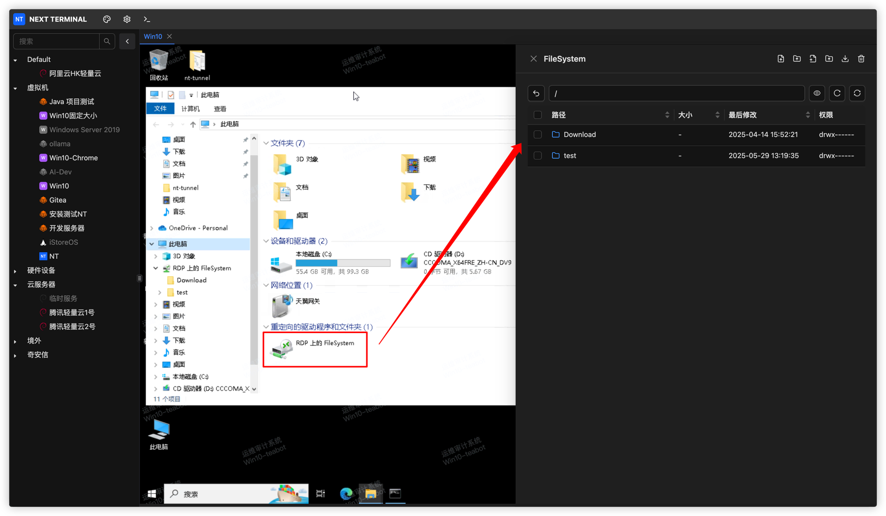

# File Management

SSH and RDP both support file management, but they expose different filesystems:

| Protocol | Browser content | Transport |
| --- | --- | --- |
| SSH | The target SSH host's actual directories | Direct SFTP access |
| RDP | Next Terminal storage | Transfer through an RDP mapped network drive |

VNC and Telnet do not provide file management.

## File operation permissions

An access strategy independently controls upload, download, file/directory creation, edit, delete, rename, copy and paste. A missing button usually means the authorization strategy does not allow it. File editing, directory upload and batch download may also require a premium license.

<!-- TODO(image): Add the access-strategy form with file-operation switches. -->

## SSH file management

The asset must use SSH, its server must support SFTP, and the user must have authorization and a suitable strategy.

Open the Web terminal and click the folder icon. Enter a path in the top field to navigate. Upload one or more files with the upload button or drag them into the list. The transfer panel shows preparation, upload, backend transmission, success and failure states; active transfers can be cancelled and failed transfers retried.

Right-click a file to download it. Depending on strategy and license, users can also batch-download, create, rename, delete, change permissions, preview images and edit text files. Hidden files can be shown from the toolbar.

> Deletion is permanent. Verify production paths before changing permissions or editing files.

<!-- TODO(image): Add the SSH filesystem, context menu and transfer-progress views. -->

## Windows / RDP file management

RDP requires storage and a network drive. See [Windows / RDP Assets](/docs/usage/rdp#windows-file-management) for administrator setup.

Upload path:

```text
Local computer → Browser File System → Next Terminal storage
→ Windows mapped drive → Copy to C:, D: or another target disk
```

Download path:

```text
Windows target disk → Copy to mapped drive → Next Terminal storage
→ Browser File System → Local computer
```



Refresh the browser list after copying a file into the mapped drive from Windows.

## Storage administration

Under **Asset Management > Storage**, administrators manage the name, sharing status, size limit and stored files. Shared storage can be selected by an RDP asset. If no shared storage is selected, the operator's default storage is used.

<!-- TODO(image): Add storage creation, storage list and administrator filesystem screenshots. -->

## Audit

Review **Log Audit > File Logs** for the user, asset, path, operation, time and result. When investigating an issue, also verify the authorization and access strategy that applied at that time.

## Troubleshooting

- **No filesystem entry:** verify SFTP for SSH, or network drive and storage for RDP; check authorization in both cases.
- **Upload finished but absent in Windows:** verify that the same storage is mapped and that backend transmission completed, not only browser upload to 99%.
- **Cannot download a Windows file:** refresh the list and check download permission, quota and copy completion.
- **Cannot upload a directory:** directory upload is a premium capability; upload individual files or a local archive instead.
