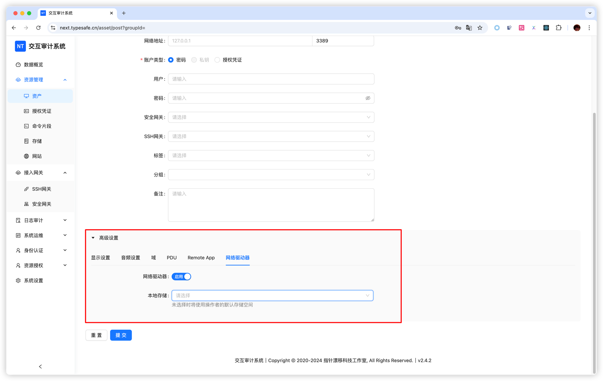
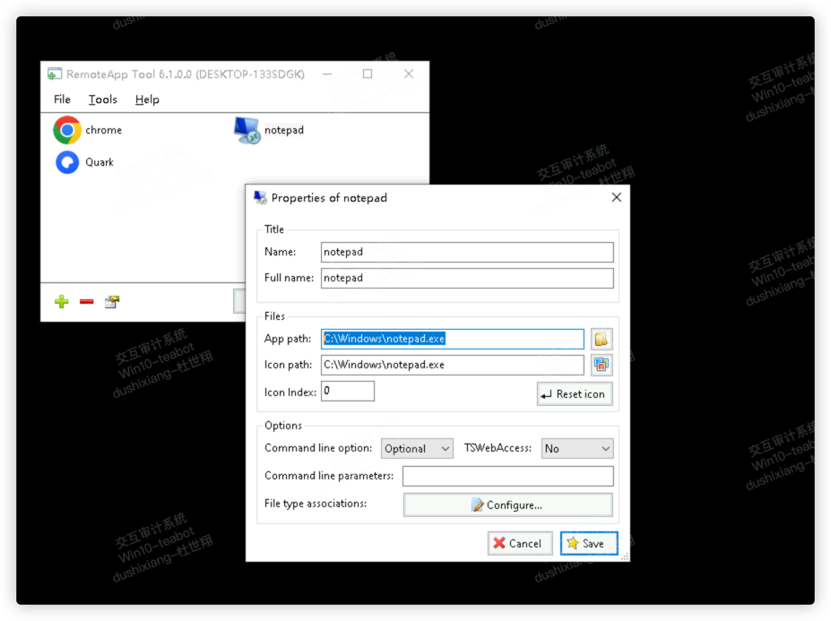
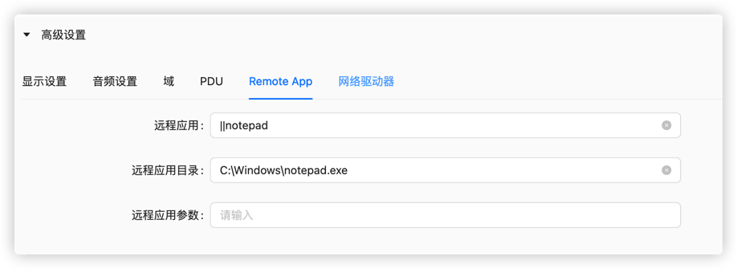
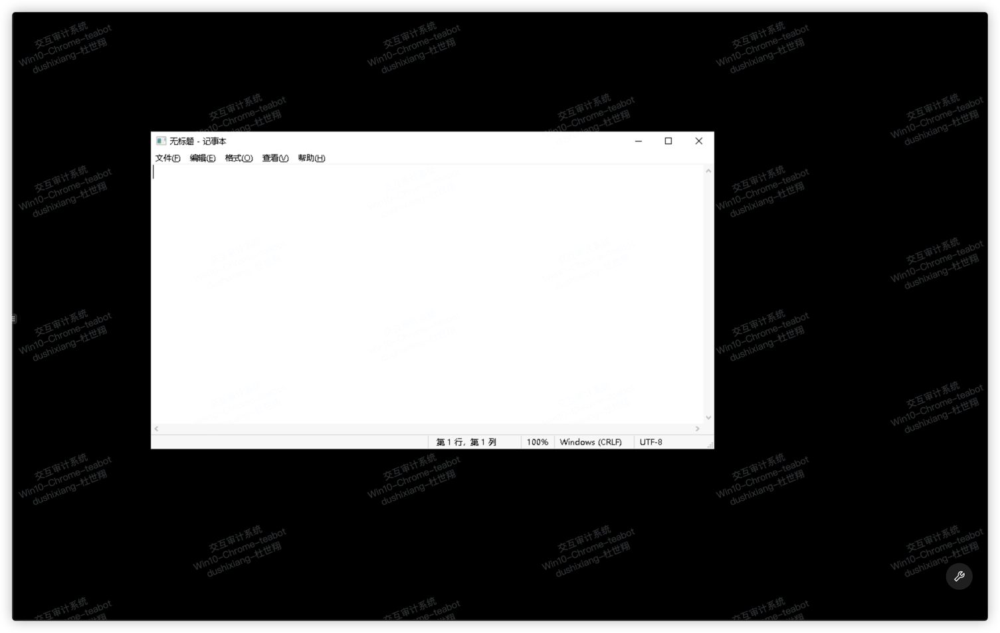

# Windows / RDP Assets

RDP assets represent Windows servers and desktops. Next Terminal supports browser-based remote desktop as well as native clients through the RDP Proxy Server and Termark.

## Add an RDP asset

Open **Asset Management > Assets**, click **Create**, and select `RDP`. The default port is `3389`.

Enter the Windows host and port, target username and password or credential, Windows domain for a domain account, and a gateway chain when direct access is unavailable.

> RDP does not support SSH private-key authentication. Remote Desktop must be enabled on Windows and the account must be permitted to sign in.

## RDP advanced settings

| Setting | Use |
| --- | --- |
| Security | Protocol negotiation and certificate validation |
| Display | Resolution, color depth, resizing and lossless compression |
| Audio | Disable playback or enable microphone input |
| Domain | Active Directory domain authentication |
| PDU | Preconnection ID/data for specific gateways or virtualization systems |
| RemoteApp | Open a published application instead of the full desktop |
| Network drive | Transfer files between the browser and Windows session |
| WOL | Wake a supported Windows device before connection |

Most full-desktop connections need only the basic fields and possibly a domain. Change security and display options when compatibility requires it.

<!-- TODO(image): Add current RDP basic, domain, security and display screenshots. -->

## Authorization and access methods

Test the asset, then assign it using [Resource Authorization](/docs/usage/authorization).

| Method | Best for |
| --- | --- |
| Browser desktop | Clientless temporary access and the unified workspace |
| [RDP Proxy Server](/docs/usage/rdp-server) | Native clients such as Windows Remote Desktop |
| [Termark](/docs/usage/termark) | A desktop inventory for authorized SSH and RDP assets |

## Browser desktop tools

The lower-right tool menu provides a file system, session sharing, clipboard panel, combinations such as `Ctrl+Alt+Delete` and `Windows+E`, and full screen. Clipboard availability depends on the authorization strategy. Use the clipboard panel when browser permission prevents automatic synchronization.

<!-- TODO(image): Add the RDP tool, clipboard and combination-key menus. -->

## Windows file management

Windows file management uses **Next Terminal storage plus an RDP network drive**. The browser does not directly browse Windows `C:` or `D:` drives.

### Administrator setup

1. Create storage under **Asset Management > Storage**, specifying its name, sharing and size limit.
2. Edit the RDP asset and open **Network Drive**.
3. Enable the drive.
4. Select shared storage, or leave it empty to use the operator's default storage.
5. Assign an access strategy that permits the required file operations.
6. Save and create a new RDP session.

### Upload from the local computer to Windows

1. Open **File System** from the RDP session tool menu.
2. Navigate to the destination directory.
3. Click upload or drag files into the list.
4. Wait for both upload and backend transmission to finish.
5. In Windows File Explorer, open the mapped drive.
6. Copy the uploaded file to the required Windows disk.

### Download from Windows to the local computer

1. Copy the file from a Windows disk into the mapped drive.
2. Open **File System** in the browser and refresh.
3. Right-click the file and choose download.
4. Multi-select batch download is a premium capability.

Buttons appear according to the access strategy. See [File Management](/docs/usage/file-management).

## RemoteApp

1. Publish the application on Windows, optionally with [RemoteApp Tool](https://github.com/kimmknight/remoteapptool).
2. Edit the asset and open **Remote App**.
3. Enter `||published_alias`, such as `||notepad`.
4. Add the application directory and arguments when required.
5. Save and reconnect.

If the full desktop opens, verify the published alias. If the app fails, verify its path, arguments and account permissions.

## Troubleshooting

- **No File System button:** enable the network drive, verify storage and strategy, then start a new session.
- **No mapped drive in Windows:** disconnect the old session completely and reconnect after saving the asset.
- **Clipboard unavailable:** check copy/paste permissions and browser clipboard permission; use the clipboard panel as a fallback.
- **Black screen or negotiation errors:** see [RDP/VNC Error Codes](/docs/usage/error-codes) and [RDP black-screen troubleshooting](/docs/blog/rdp-black-screen-failed).
