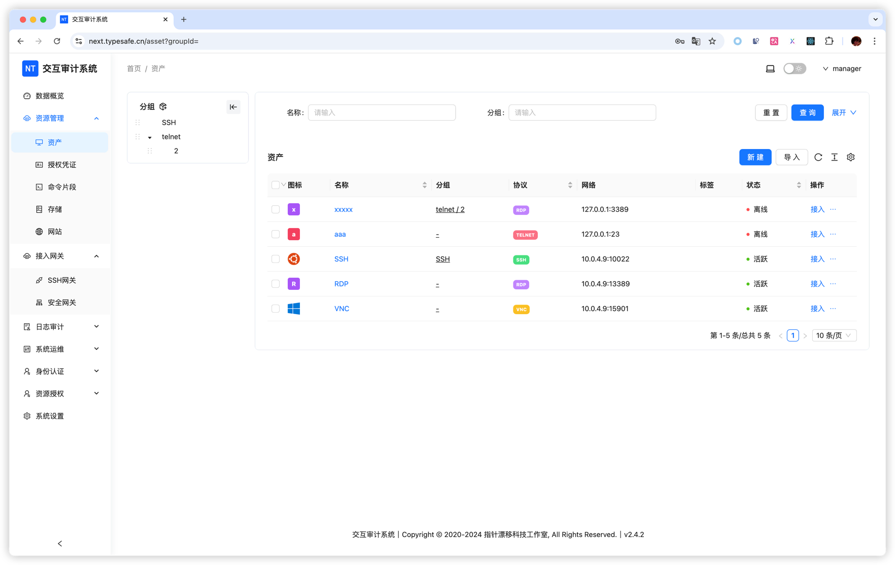

# 资产管理总览

Next Terminal 将不同类型的远程资源统一称为“资产”。不同协议的配置方式、接入入口和可用功能差异较大，因此本文只介绍共通概念；具体操作请进入对应的协议文档。

## 按资产类型阅读

| 要管理的资源 | 应阅读的文档 | 主要能力 |
| --- | --- | --- |
| Linux、Unix、网络设备 | [SSH 资产](/zh/docs/usage/ssh) | Web 终端、SFTP 文件管理、命令片段、SSH 客户端接入 |
| Windows 服务器和桌面 | [Windows / RDP 资产](/zh/docs/usage/rdp) | Web 远程桌面、剪贴板、网络驱动器、RemoteApp、本地 RDP 客户端 |
| 图形远程控制服务 | [VNC 与 Telnet 资产](/zh/docs/usage/vnc-telnet) | VNC 图形会话、Telnet 字符终端 |
| 内部网站 | [Web 资产](/zh/docs/usage/website) | 身份认证、反向代理、访问控制、内网发布 |
| MySQL 等数据库 | [数据库审计](/zh/docs/usage/database) | 数据库代理、SQL 审批和审计 |

## 创建资产的通用流程

不论使用哪种协议，配置通常都遵循下面的顺序：

1. 确认 Next Terminal 或所选网关能够访问目标地址和端口。
2. 准备目标系统的账号密码或私钥；需要复用时先创建[授权凭证](/zh/docs/usage/credential)。
3. 在「资产管理 > 资产」中点击「新建」。
4. 选择协议，填写名称、地址、端口和账号。
5. 根据协议填写高级设置。
6. 保存后使用管理员账号测试连接。
7. 通过[资源授权](/zh/docs/usage/authorization)将资产分配给用户或部门。
8. 使用浏览器、代理服务器或 Termark 进行正式接入。

## 通用字段

| 字段 | 作用 |
| --- | --- |
| 名称 | 在管理端和用户资产列表中展示的名称 |
| 别名 | SSH 代理服务器直连模式使用的目标名称；只能包含英文、数字、下划线或中划线，且必须以字母开头 |
| 分组 | 构建资产树层级，也可用于批量授权 |
| 协议 | 决定默认端口、认证方式、会话类型和高级设置 |
| 网络地址 | 目标主机的 IP/域名和端口，必须能从实际连接路径访问 |
| 账户类型 | 直接填写密码、SSH 私钥，或引用授权凭证 |
| 网关链 | 目标资产无法直连时使用的转发路径 |
| 标签 | 用于跨分组检索环境、地域、负责人等属性 |
| 备注 | 记录用途和负责人，不应保存密码、令牌等秘密信息 |

## 分组、标签与批量导入

- **分组**适合表达稳定的层级，例如「生产环境 / 上海 / Windows」。
- **标签**适合表达跨层级属性，例如 `critical`、`finance`、`vendor`。
- **批量导入**适合首次接入大量资产。请从当前页面下载模板，先用少量数据试导入，再核对协议、端口、凭证、分组和网关。
- **批量编辑**可用于统一修改网关等属性；操作前确认选择范围。

<!-- TODO(image): 补充分组编辑、标签筛选、批量导入和批量编辑截图。 -->

## 如何选择网关

- Next Terminal 服务端能够直接访问目标资产：不选择网关。
- 目标位于 VPC、办公室内网或异地机房：优先使用[安全网关](/zh/docs/usage/agent-gateway)。
- 已有 SSH 跳板机，需要通过端口转发访问目标：使用 [SSH 网关](/zh/docs/usage/ssh-gateway)。
- 使用网关链时，资产地址应填写从最后一级网关能够访问的地址，而不是用户电脑看到的地址。

## 创建后为什么还不能使用

创建资产只保存了连接信息，不会自动授予普通用户访问权限。请继续检查：

1. 管理员能否成功连接目标资产。
2. 用户或部门是否获得了资源授权。
3. 授权是否过期。
4. 授权关联的访问策略是否允许所需操作，例如上传、下载和剪贴板。
5. 当前接入方式是否支持该协议。

## 相关功能

- [授权凭证](/zh/docs/usage/credential)
- [资源授权与访问策略](/zh/docs/usage/authorization)
- [文件管理](/zh/docs/usage/file-management)
- [浏览器访问工作区](/zh/docs/usage/access)
- [安全网关](/zh/docs/usage/agent-gateway)
- [SSH 网关](/zh/docs/usage/ssh-gateway)
