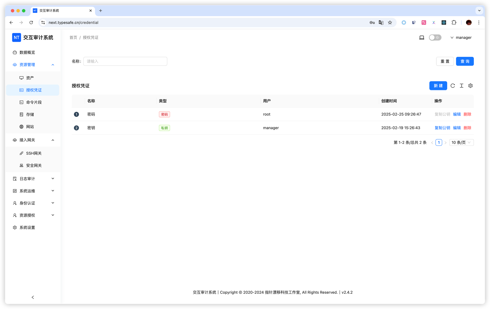

# 授权凭证

授权凭证用于保存目标主机的账号认证信息，可被资产和 SSH 网关引用。它与用户登录 Next Terminal 的密码不是同一类凭证。

## 何时使用

- 多台资产共用同一个运维账号。
- 希望轮换密码或私钥时只修改一处。
- 不希望在每条资产记录中重复填写秘密信息。

单台资产使用独立账号时，也可以直接在资产中填写密码或私钥。

## 创建密码凭证

1. 进入「资产管理 > 授权凭证」。
2. 点击「新建」。
3. 填写名称，类型选择「密码」。
4. 填写目标主机用户名和密码。
5. 保存。

## 创建私钥凭证

1. 类型选择「私钥」。
2. 填写目标 SSH 用户名。
3. 粘贴已有私钥，或者点击“生成私钥”。
4. 私钥已加密时填写 Passphrase。
5. 保存后，在凭证列表点击“复制公钥”。
6. 将公钥加入目标账号的 `authorized_keys`。

<!-- TODO(image): 补充密码凭证和私钥凭证表单。 -->

## 在资产中使用

编辑或新建资产，将“账户类型”设置为“授权凭证”，然后选择凭证。私钥凭证只适用于 SSH；RDP 和 VNC 使用密码类凭证。

## 查看和修改秘密信息

编辑已有凭证时，查看私钥或密码可能要求进行 MFA 验证。这一流程用于防止已经登录管理端的会话直接读取明文凭证。

## 轮换与删除

- 修改共享凭证会影响所有引用它的资产和 SSH 网关，更新后应逐项测试。
- 删除凭证前，系统会检查资产和 SSH 网关引用；仍被引用的凭证不能直接删除。
- 建议按环境和权限命名，例如 `prod-linux-ops`，避免所有资产共用一个高权限凭证。

## 常见问题

- **生成私钥后仍无法登录：** 需要把对应公钥安装到目标账号。
- **凭证更新后部分资产失败：** 检查这些资产是否确实引用该凭证，以及目标账号是否同步完成轮换。
- **无法删除：** 先根据提示解除资产或 SSH 网关引用。
