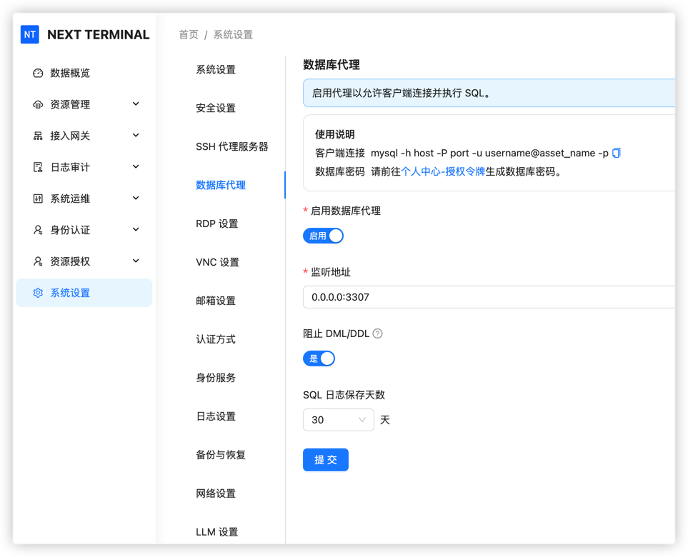
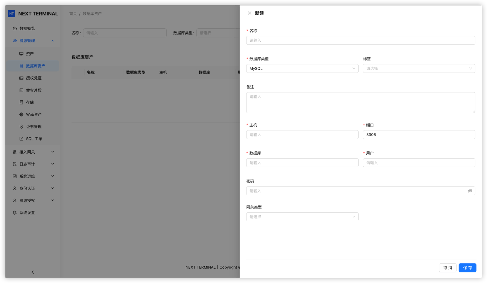
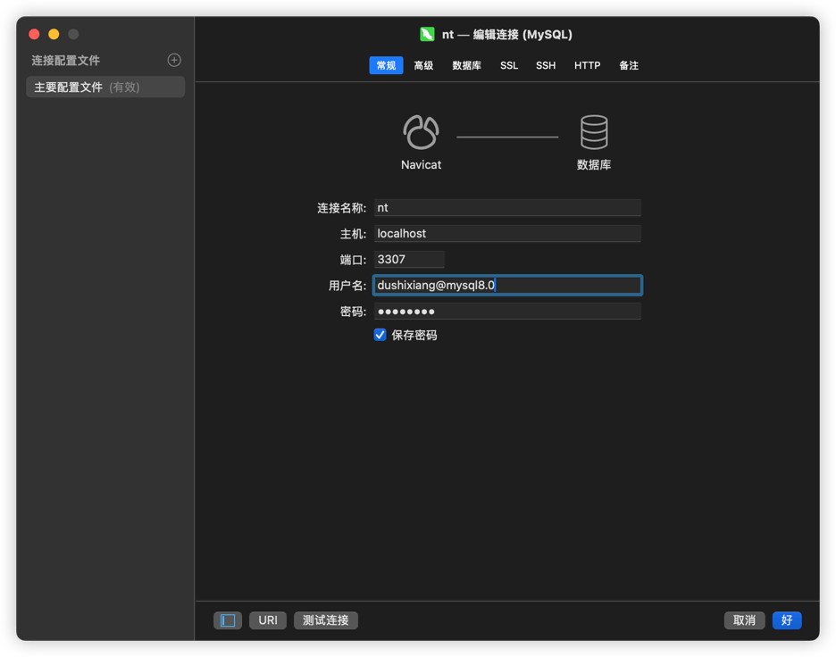
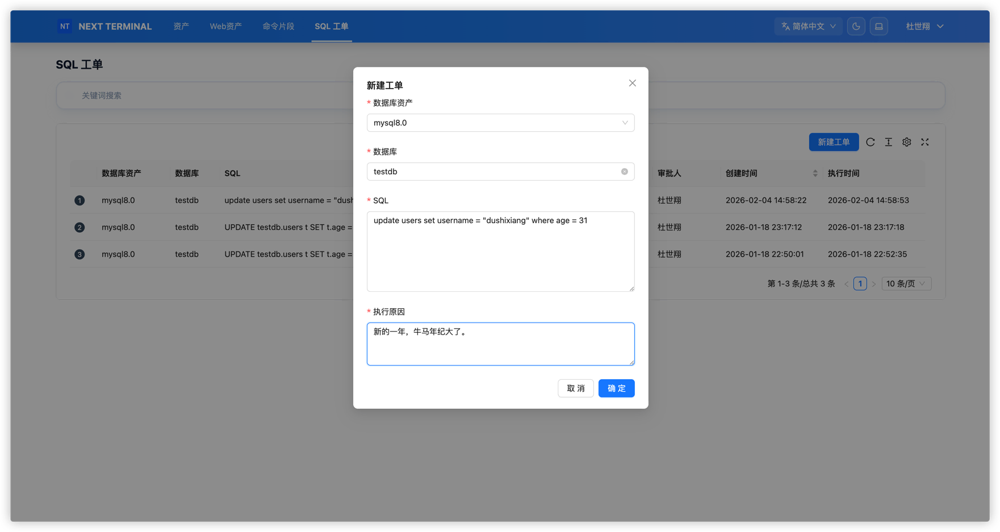
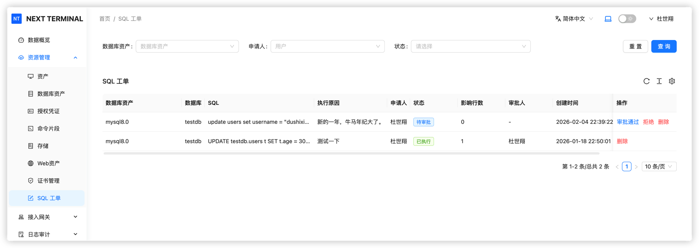
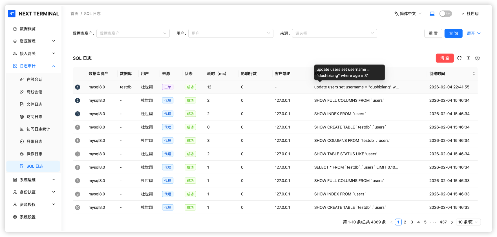

# 数据库审计

## 功能概述

自 v3.0.0 版本起，Next Terminal 新增了 MySQL 数据库协议级审计功能，为数据库操作提供企业级安全管理能力。

### 核心特性

- **协议级拦截**：在 SQL 协议层面拦截 DML（数据操作语言）和 DDL（数据定义语言）语句
- **查询语句放行**：默认放行所有查询（SELECT）语句，确保日常查询不受影响
- **工单审批流程**：增、删、改等危险操作需要通过工单审批后才能执行
- **完整操作日志**：记录所有 SQL 执行记录，支持审计追溯

## 配置步骤

### 1. 启用数据库代理

进入系统设置，找到数据库代理选项并启用。

### 2. 创建数据库密码

进入个人中心，创建令牌选择数据库密码。

### 3. 添加数据库资产

在资产管理中添加数据库配置：

- 填写数据库连接信息（主机、端口、数据库名等）
- 支持通过网关连接数据库

### 4. 配置用户权限

在资源授权处配置用户权限：

- 支持配个单个用户权限
- 支持按部门配置用户权限

## 日常使用

### 连接数据库

使用任意 MySQL 客户端工具（如 Navicat、DataGrip、MySQL Workbench 等）连接数据库。

> mysql -h host -P port -u username@asset_name -p

- host: NextTerminal 所在机器的 IP
- port：网页上配置的数据库代理端口
- u：NextTerminal用户账号@资产名称 （用户账号不是用户名称，切记！）
- p：个人中心配置的数据库密码（每个人的密码都不一样，不要使用 A 的密码去用 B 的账号连接）

### 执行查询

连接成功后，可以正常执行所有查询（SELECT）语句，不受任何限制。

### 执行变更操作

当尝试执行 DDL（如 CREATE、ALTER、DROP）或 DML（如 INSERT、UPDATE、DELETE）语句时，操作将被阻止，并提示需要通过工单审批。

## 工单流程

### 发起工单

当需要执行数据变更操作时，在用户界面发起 SQL 工单：

1. 选择目标数据库
2. 填写需要执行的 SQL 语句
3. 填写变更说明和原因
4. 提交工单等待审批

### 工单审批与执行

- **管理员审批**：管理员在后台审核工单内容
- **自动执行**：工单审批通过后，系统将自动执行 SQL 语句
- **执行反馈**：执行结果会通知到申请人

## 审计日志

### 查看执行记录

系统会记录所有 SQL 执行日志，包括：

- **执行时间**：SQL 语句的执行时间戳
- **执行用户**：发起操作的用户信息
- **SQL 语句**：完整的 SQL 语句内容
- **执行结果**：成功、失败或被拦截
- **影响行数**：变更操作影响的数据行数

管理员可以通过审计日志进行安全审计和问题追溯。

## 安全优势

通过数据库审计功能，Next Terminal 为您提供：

- ✅ **误操作防护**：避免误删除、误修改等危险操作
- ✅ **权限隔离**：普通用户只能查询，变更需要审批
- ✅ **操作追溯**：完整的审计日志，支持事后追查
- ✅ **合规要求**：满足企业级数据库操作合规要求