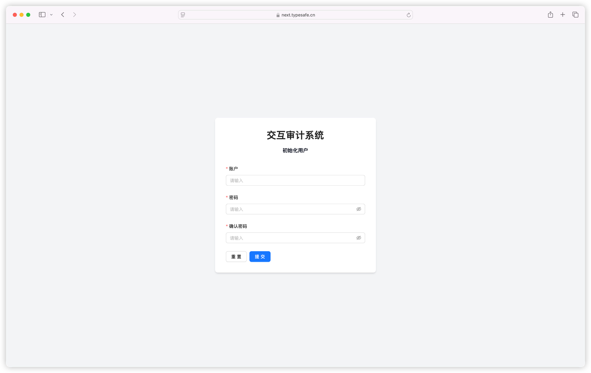
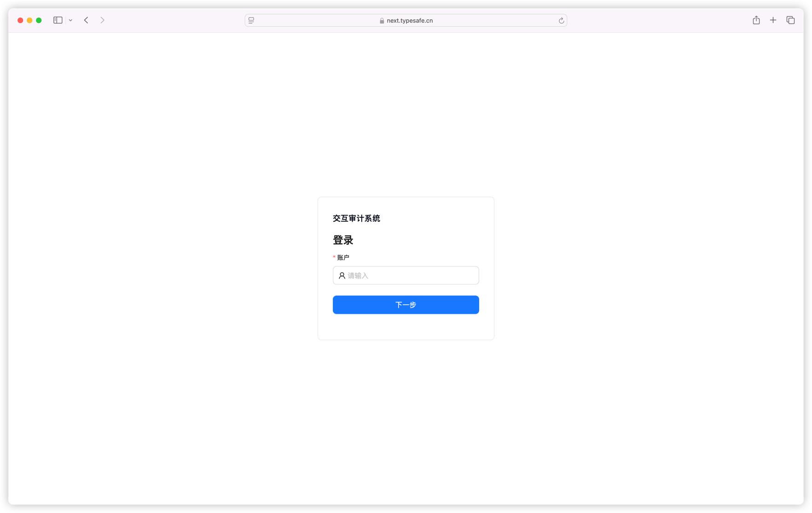
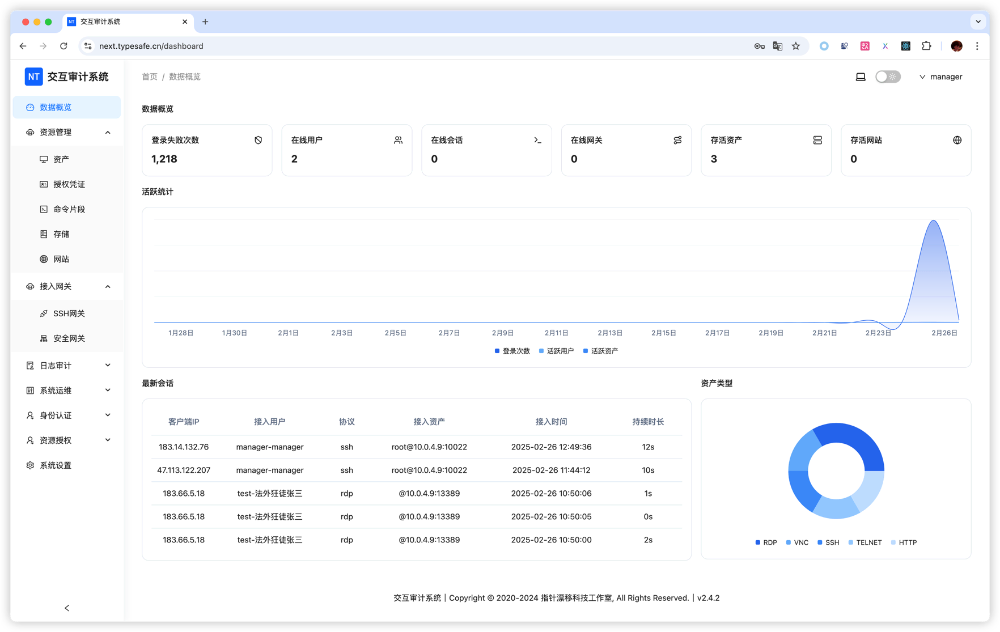

# 快速开始

本页帮助你完成从首次登录到打开第一台资产的最短路径。已经在使用系统的管理员，也可以通过下面的文档地图直接找到任务。

## 第一次使用

### 1. 初始化管理员

首次安装后，按照页面提示创建管理员账号。

### 2. 登录管理端

使用管理员账号登录。仪表盘用于查看资产、会话和系统运行概况。

### 3. 选择要接入的资源

- Linux、Unix 或网络设备：[SSH 资产](/zh/docs/usage/ssh)
- Windows 服务器或桌面：[Windows / RDP 资产](/zh/docs/usage/rdp)
- VNC 或 Telnet：[VNC 与 Telnet 资产](/zh/docs/usage/vnc-telnet)
- 内部网站：[Web 资产](/zh/docs/usage/website)
- 数据库：[数据库审计](/zh/docs/usage/database)

如果目标位于 Next Terminal 无法直接访问的内网，请先部署[安全网关](/zh/docs/usage/agent-gateway)或配置 [SSH 网关](/zh/docs/usage/ssh-gateway)。

### 4. 创建凭证和资产

需要复用账号时，先创建[授权凭证](/zh/docs/usage/credential)。随后在「资产管理」中创建资产，填写协议、地址、端口和目标账号，并进行一次管理员连接测试。

资产字段和分组方式参阅[资产管理总览](/zh/docs/usage/asset)。

### 5. 授权给用户

在「资源授权 > 资产授权」中选择用户或部门，再选择资产或资产分组。按实际需要关联访问策略并设置到期时间。

参阅[资源授权与访问策略](/zh/docs/usage/authorization)。

### 6. 打开资产

普通用户登录后，从[浏览器访问工作区](/zh/docs/usage/access)打开已经授权的资产。需要本地客户端时，可以选择：

- [SSH 代理服务器](/zh/docs/usage/ssh-server)
- [RDP 代理服务器](/zh/docs/usage/rdp-server)
- [Termark](/zh/docs/usage/termark)

### 7. 检查审计记录

完成一次测试操作后，管理员应检查在线/离线会话、命令日志、文件日志和访问日志，确认授权、录像和审计结果符合预期。

## 按任务查找文档

| 我想完成的任务 | 文档 |
| --- | --- |
| 添加和整理不同协议的资产 | [资产管理总览](/zh/docs/usage/asset) |
| 管理密码和 SSH 私钥 | [授权凭证](/zh/docs/usage/credential) |
| 给用户分配资产和文件权限 | [资源授权与访问策略](/zh/docs/usage/authorization) |
| 在 Linux 主机上传、下载文件 | [SSH 文件管理](/zh/docs/usage/file-management#ssh-文件管理) |
| 在 Windows 和本地电脑之间传文件 | [Windows 文件管理](/zh/docs/usage/rdp#windows-文件管理) |
| 连接 VPC、办公室或异地内网 | [安全网关](/zh/docs/usage/agent-gateway) |
| 用标准 SSH 客户端访问资产 | [SSH 代理服务器](/zh/docs/usage/ssh-server) |
| 用 Windows 远程桌面访问资产 | [RDP 代理服务器](/zh/docs/usage/rdp-server) |
| 发布需要登录授权的内部网站 | [Web 资产](/zh/docs/usage/website) |
| 配置 MFA | [Passkey](/zh/docs/usage/passkey)或 [TOTP](/zh/docs/usage/otp) |

## 推荐的上线检查

1. 管理员和普通用户分别完成一次资产接入。
2. 验证普通用户只能看到已授权资产。
3. 验证上传、下载、剪贴板等按钮符合访问策略。
4. 对外入口启用 HTTPS 和 MFA。
5. 核对会话、命令和文件审计日志。
6. 为临时授权设置到期时间，避免权限长期遗留。
