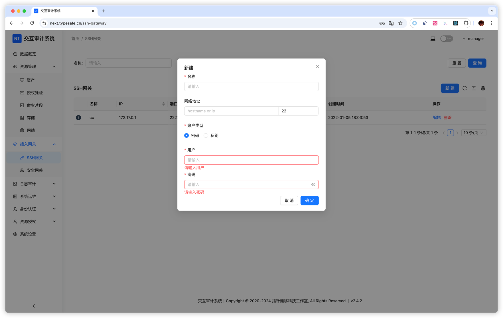

# SSH 网关

## 概述

SSH 网关用于加速海外资产访问，无需安装任何程序，利用 SSH Server 的端口转发（Port Forwarding）功能实现流量中转。

**工作原理**

1. NextTerminal 主动连接到一台跳板机（SSH Server）
2. 添加资产时选择该 SSH 网关
3. 访问资产时，流量通过跳板机的 SSH 端口转发到目标服务器

**应用场景**

- 加速访问海外服务器（如国内访问海外资产较慢时，通过海外跳板机中转）
- 提升跨地域资产的连接速度

## 使用流程

### 1. 添加 SSH 网关

在「SSH 网关」管理页面中配置跳板机信息：
- 名称：例如 "海外跳板机"
- 地址：跳板机的 IP 或域名
- 端口：SSH 端口（默认 22）
- 用户名：SSH 登录用户
- 密码或密钥：认证凭据

### 2. 添加资产并关联网关

在添加海外资产时：
- 填写资产的 IP 地址
- 在「SSH 网关」下拉框中选择对应的跳板机
- 填写其他连接信息

### 3. 访问资产

访问该资产时，流量会通过 SSH 网关中转，提升连接速度。

**示例**

假设国内访问美国服务器 `us-server.example.com` 较慢，可通过美国跳板机 `us-jump.example.com` 加速：

1. 添加 SSH 网关：地址填 `us-jump.example.com`
2. 添加资产：地址填 `us-server.example.com`，选择该 SSH 网关
3. 访问时流量通过美国跳板机中转，提升连接速度

## 注意事项

- 确保 SSH Server 允许端口转发（`sshd_config` 中 `AllowTcpForwarding` 需开启）
- 跳板机与目标资产之间需要有良好的网络连接